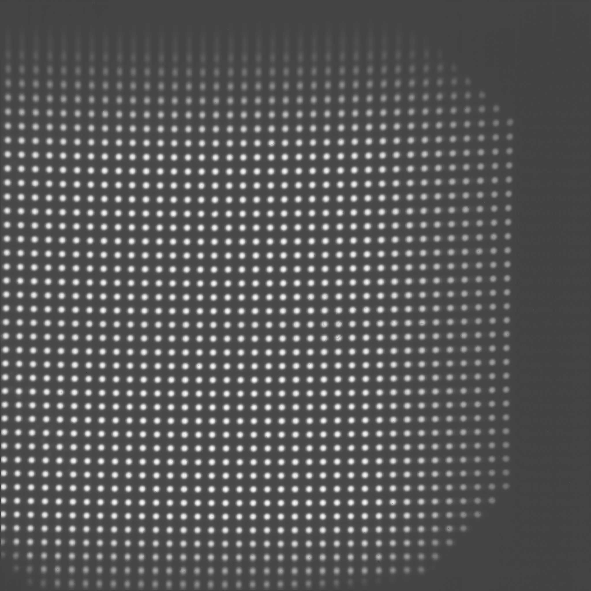

Dewarping
=================

Okay, now we're going to move past the make_dirs() function in the template
script and actually try to remap a FITS frame onto a smoothed basis.

**********
Requirements
**********

A FITS frame of sources which can be centroided like PSFs. Image should be
dark-subtracted and bad-pixel corrected so that the centroiding will work right.
A useable frame may look like this:

.. _pinhole_ex:

**********
The idea
**********

We want to find the polynomial coefficients that map between empirical pinhole
locations and an idealized grid. We use a direct transliteration of IDL's
``polywarp`` procedure, which finds the coefficients
:math:`K_{x}^{(i,j)}` and :math:`K_{y}^{(i,j)}` in the following polynomial
mapping among :math:`(x,y)` coordinates between the warped and ideal readouts:

:math:`x_{i}=\sum^{N}_{i=0}\sum^{N}_{j=0}K_{x}^{(i,j)}x_{o}^{(j)}y_{o}^{(i)}`

:math:`\underbrace{y_{i}}_\text{warped}=\sum^{N}_{i=0}\sum^{N}_{j=0}K_{y}^{(i,j)}\underbrace{x_{o}^{(j)}y_{o}^{(i)}}_\text{dewarped}`

Note which sides of the mapping represent the 'warped' and 'dewarped'
coordinates in this application, which may be opposite to what one may
expect intuitively, or from the IDL documentation on
polywarp. Let's see why we do it this way by plunging into
the functions called within the ``find_dewarp_solution.py`` script.

Match empirical with model sources: ``match_pinholes.match_pinholes()``
^^^^^^^^^

Within the template pipeline ``template_pipeline.py``, you will see a call to
``match_pinholes.match_pinholes()``. This overlays a model coordinate grid
over the image that you need to try to match by tweaking the rotation,
offset, and barrel settings. You may have to run through a couple
times until you get a good match. The match doesn't have to
be exact; we're just making a grid so that the code recognizes which
empirical point sources it detects can be matched with model points

Once that’s done, run the script again so that it runs past the
function ``make_dewarp_coords()``. This finds the aforementioned
coefficients by solving a least-squares problem via Moore-Penrose
pseudoinverse matrices.

Here is an example of a matching that left some aliasing in the form
of a crescent. If you see aliasing like this, tweak the parameters and
try again:

.. _label: kinks2
.. figure:: images/kinks2.png
	   :scale: 90 %
           :align: center
	   :alt: Alternative text

You should end up with something that looks roughly like this:

.. _label: matching_grids
.. figure:: images/matching_grids.pdf
	   :scale: 100 %
           :align: center
	   :alt: Alternative text

The match with the pinholes isn't perfect, but that's okay. We just
need to avoid aliasing. Also note that some individual pinholes
have been missed, but the code will just interpolate through them. If
you're picky, try changing the parameters of the centroiding and try again.

Make the mapping: ``find_dewarp_solution.find_dewarp()``
^^^^^^^^^

This next function takes the raw image, pastes the warped coordinates onto it,
and then smooths everything out by resampling the image point-by-point over the
entire image space, interpolating as needed when the coordinates are not at
integer values (Fig. :numref:`warp_dewarp_grids_annotated`). As a check,
closely compare the pinhole grid images before and after (Fig.
:numref:`barb_plot_sx_2019jan`).

.. _label: warp_dewarp_grids_annotated
.. figure:: images/warp_dewarp_grids_annotated.pdf
	   :scale: 50 %
           :align: center
	   :alt: Alternative text

The last part of the script makes a barb plot, putting evenly-spaced vectors over the array to show the directions that points on the readouts have to be stretched in order to dewarp it:

.. _label: barb_plot_sx_2019jan
.. figure:: images/barb_plot_sx_2019jan.pdf
	   :scale: 50 %
           :align: center
	   :alt: Alternative text

Apply the dewarp solution
^^^^^^^^^

There are two ways of doing this. One is to just let the pipeline run to the next
function, ``apply_dewarp_solution.apply_dewarp()``. The second way is to copy
and the Kx and Ky matrices that were printed to screen in the last step, and
paste them into the script ``simple_dewarp.py'', and edit that script as necessary
to dewarp your full dataset.
