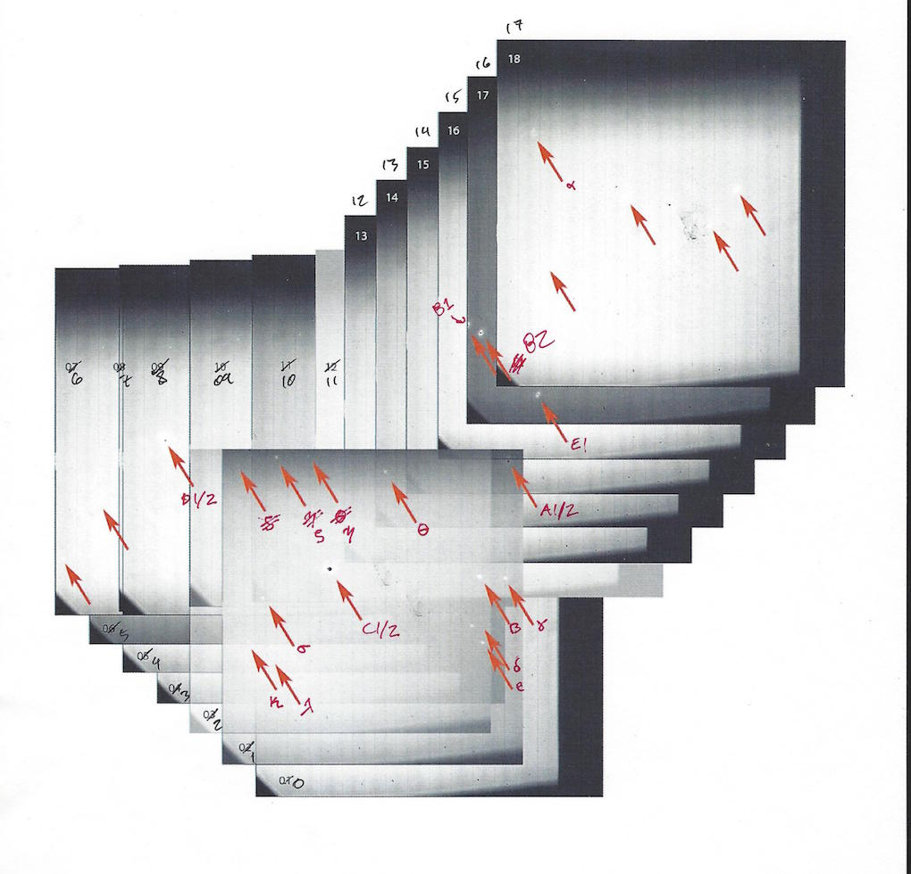

Sky orientation and plate scale
=================

**********
Requirements
**********

#. Asterism images (preferably dewarped)
#. A csv of known stellar targets with RA and DEC

**********
The idea
**********

We flag star positions in pixel space, and compare their locations in
RA, DEC. All possible baselines are used between identified stars to
find their separations and angles relative to north at PA=0.

**********
Procedure
**********

Derotate the images based on meta-data (if applicable): derotation.derotate_image_forloop()
^^^^^^^^^

If there is parallactic angle information in the image meta-data (like
in the FITS header), use this to derotate the asterism images. We'll
find what residual there remains. If you have no parallactic angle
meta-data, the following procedure should still work.

Note that in one
frame of Ns stars, the total number of baselines among stellar pairs
is “Ns choose 2”:

:math:`N_{b}=\begin{pmatrix}N_{s} \\ 2\end{pmatrix} \equiv \frac{N_{s}!}{2!(N_{s}-2)!}=\frac{N_{s}(N_{s}-1)}{2}`

 
Find stars in pixel space: find_asterism_star_locations.find_stars()
^^^^^^^^^

As an aid to identifying the stars, you might want to overlay the derotated
asterism images and then cross-check them with a known astrometric source. In
the case of the Trapezium Cluster, one can use the images and Table 1
in Close+ 2012 ApJ 749:180. In this figure, I labeled stars using the
conventions in Close+ 2012, and used my own Greek lettering if they
were without label:

.. _label:

The script find takes the intermediary step of
determining star locations in pixel space, and printing locations in pixel space to
the screen. Check each centroid manually in the plot, to see if it’s a real star or
not. Copy the true positive locations in pixel space that are returned in
the Terminal.

Find plate scale, angle offset: comparison.angOffset_plateScale()
^^^^^^^^^

This function will make CDF plots with 1-sigma-equivalent boundaries,
like these:

.. _label:
.. figure:: images/plate_scale_sx_2018dec.pdf
	   :scale: 70 %
           :align: center
	   :alt: Alternative text

.. _label:
.. figure:: images/rotation_corrxn_dx_2018dec.pdf
	   :scale: 70 %
           :align: center
	   :alt: Alternative text
